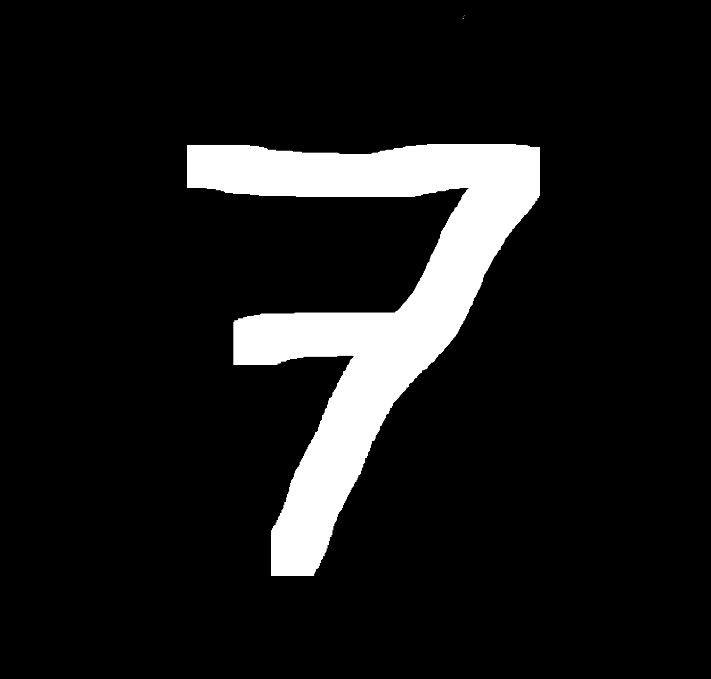
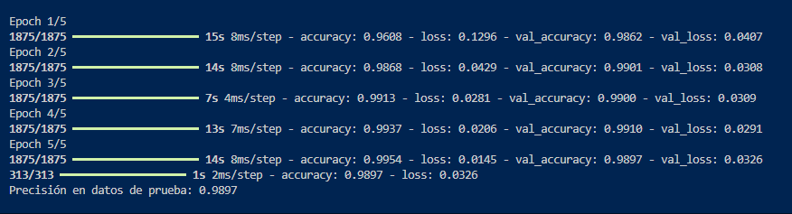
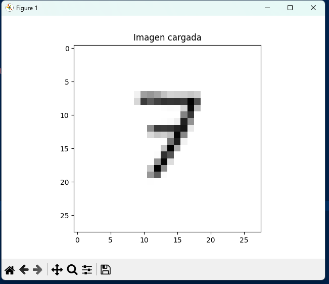

# Reconocimiento de Dígitos con Red Neuronal Convolucional

## Este proyecto implementa una red neuronal convolucional (CNN) usando **TensorFlow** y **Keras** para reconocer dígitos escritos a mano utilizando el dataset **MNIST**.  
### Además, permite probar imágenes personalizadas para evaluar el rendimiento del modelo.

## Requisitos
### Antes de ejecutar el proyecto, asegúrate de tener instalado:


* Python 3.8 o superior  
- TensorFlow  
- Matplotlib  
- Numpy  
- Pillow    

**Puedes instalar las dependencias con:**  
```bash
pip install tensorflow matplotlib numpy pillow
```
## __Ejecución del proyecto__

**1. Clona el repositorio:** 

https://github.com/Enriquesoto300/CNN.git


**2. Ingresa al directorio:**

```cd CNN```

**3. Ejecuta el programa:**

```python ProyecCNN.py```


## Explicación del código

### 1. Importar librerías


```
import tensorflow as tf
from tensorflow.keras import layers, models
import matplotlib.pyplot as plt
import numpy as np
from PIL import Image
```
* TensorFlow/Keras: Construcción y entrenamiento de la red neuronal.
* Matplotlib: Visualización de imágenes
* NumPy: Manipulación de arrays.
* PIL (Pillow): Carga y preprocesamiento de imágenes externas.


## Cargar y preparar MNIST

```
(x_train, y_train), (x_test, y_test) = tf.keras.datasets.mnist.load_data()

x_train = x_train / 255.0
x_test = x_test / 255.0

x_train = x_train[..., tf.newaxis]
x_test = x_test[..., tf.newaxis]
```
* Se carga el dataset MNIST.
* Se normalizan los valores de píxeles a rango [0, 1].
* Se agrega una dimensión de canal para que TensorFlow lo interprete como imágenes en escala de grises (28, 28, 1).

## 3. Definir la red neuronal convolucional (CNN)
```
model = models.Sequential([
    layers.Conv2D(32, kernel_size=(3, 3), activation='relu', input_shape=(28, 28, 1)),
    layers.MaxPooling2D(pool_size=(2, 2)),
    layers.Conv2D(64, kernel_size=(3, 3), activation='relu'),
    layers.MaxPooling2D(pool_size=(2, 2)),
    layers.Flatten(),
    layers.Dense(128, activation='relu'),
    layers.Dense(10, activation='softmax')
])
```
* Conv2D: Detecta características de la imagen (bordes, esquinas, formas).
* MaxPooling2D: Reduce la dimensionalidad y conserva características importantes.
* Flatten: Convierte los mapas de características en un vector.
* Dense (128 neuronas): Capa totalmente conectada con activación ReLU.
* Dense (10 neuronas, softmax): Capa de salida para clasificar en 10 dígitos (0–9).

## 4. Compilar el modelo
```
model.compile(optimizer='adam',
              loss='sparse_categorical_crossentropy',
              metrics=['accuracy'])

```
* Optimizer = Adam: Ajusta pesos de forma eficiente.
* Loss = Sparse Categorical Crossentropy: Función de pérdida adecuada para clasificación multiclase.
* Metrics = Accuracy: Se mide la precisión del modelo.

## 5. Entrenamiento del modelo
``` 
model.fit(x_train, y_train, epochs=5, validation_data=(x_test, y_test))
```
* Entrena con los datos de entrenamiento durante 5 épocas (epochs).

* Valida contra el conjunto de prueba en cada época.

## 6. Evaluación
```
test_loss, test_acc = model.evaluate(x_test, y_test)
print(f'Precisión en datos de prueba: {test_acc:.4f}')
```
* Evalúa la precisión del modelo con datos que nunca ha visto antes.

* Normalmente se alcanza una precisión cercana al 99%

## 7. Probar con imágenes externas
```
def predecir_imagen(ruta_imagen):
    img = Image.open(ruta_imagen).convert("L")
    img = img.resize((28, 28))
    img_array = np.array(img)
    img_array = 255 - img_array
    img_array = img_array / 255.0
    img_array = np.expand_dims(img_array, axis=-1)
    img_array = np.expand_dims(img_array, axis=0)

    plt.imshow(img_array[0].reshape(28, 28), cmap="gray")
    plt.title("Imagen cargada")
    plt.show()

    prediccion = model.predict(img_array)
    print(f"Predicción de la red: {np.argmax(prediccion)}")
```


1. Convierte la imagen a escala de grises.
2. La redimensiona a 28x28 píxeles.
3. Invierte los colores (MNIST usa fondo negro y dígito blanco).
4. Normaliza y ajusta la forma para ser compatible con el modelo.
5. Muestra la imagen y devuelve la predicción.

## 8. Uso con tu propia imagen
```
predecir_imagen(r"C:\Users\Trans\Downloads\CNN\img\SieteDeMNIST.png")
```
* Cambia la ruta por la ubicación de tu propia imagen.

* La imagen debe ser un dígito en blanco sobre fondo oscuro.

## Imagen utilizada:



## Resultados





* Precisión en el conjunto de prueba: ~99%.

* Capacidad de reconocer correctamente dígitos externos si están bien preprocesados.

## Conclusiones

* El código funciona como esperado
* Las CNN son altamente efectivas para reconocimiento de imágenes.
* El modelo entrenado puede generalizar y reconocer imágenes externas, siempre que se preprocesen correctamente.
* No vuelvo a reprobar 
